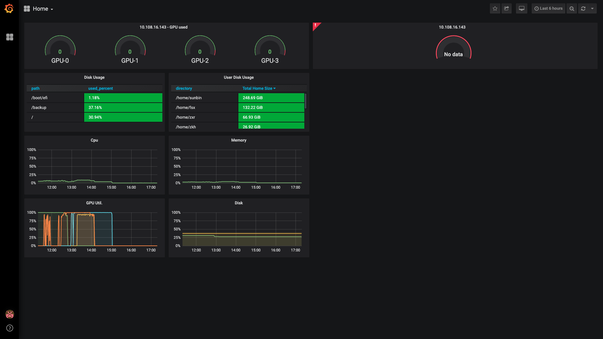

# telegraf_influxdb_grafana 分布式服务器集群监控
## Install
### 1. install influx and grafana

#### command

`docker-compose up`

#### grafana 模板地址
```
https://snapshot.raintank.io/dashboard/snapshot/NK6Vqjpmraa6fM8cSwRFNVwTqulW4RSw
```
### 2. config telegraf
#### 1. dowland telegraf

在原有基础功能基础上，实现了
1. 对`home`目录占用监控的功能
2. GPU使用情况监控

```bash
wget https://dl.influxdata.com/telegraf/releases/telegraf_1.10.4-1_amd64.deb
sudo dpkg -i telegraf_1.10.4-1_amd64.deb
```
#### 2. edit telegraf.conf

修改第1400行（这里不知道相对路径可不可以，没测试）
```
commands=["bash /home/nlpgroup/watch_path.sh"]
```

#### 3. run

这里需要root权限来对home文件大小统计。
```
sudo nohup telegraf --config telegraf.conf &
```

#### 4. restart telegraf (if needed)
```bash
#修改配置后重启
$ ps -ef|grep telegraf
$ sudo kill -9 [ID]
$ sudo nohup telegraf --config telegraf.conf &
```

### Result

